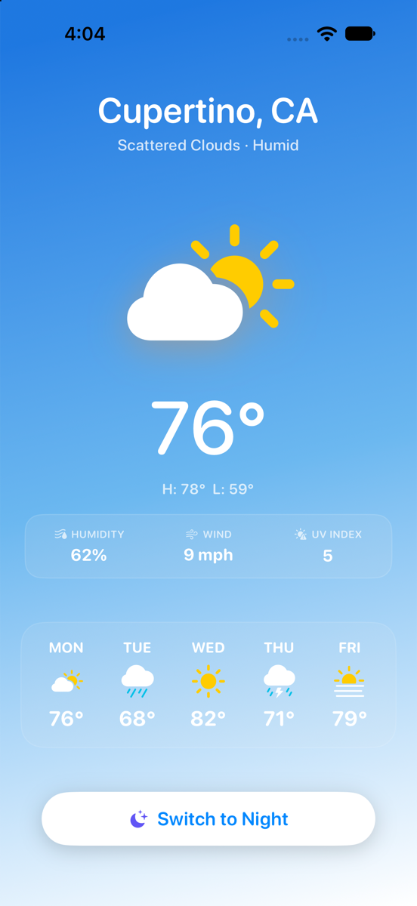
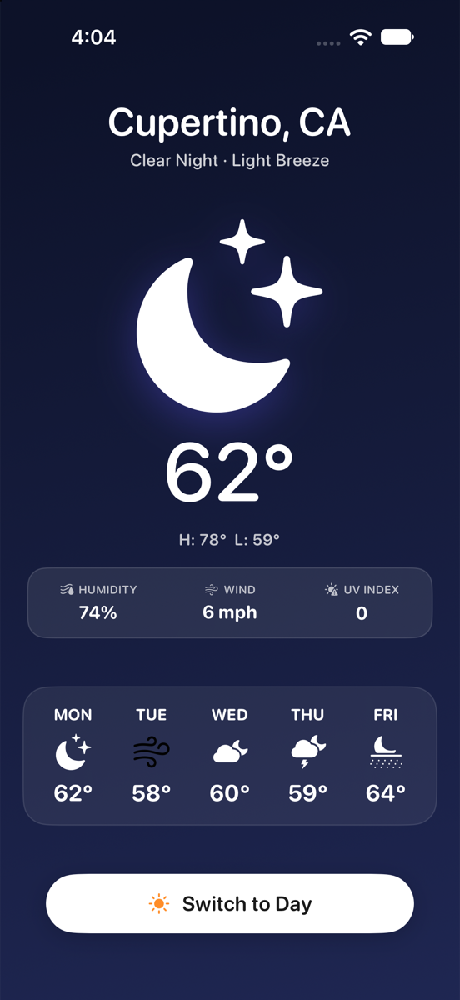

# Cupertino Weather

A native iOS and macOS weather application built with Swift and SwiftUI, featuring dynamic day/night atmospheric transitions, frosted glass telemetry metrics, and SF Symbols.

[](https://swift.org/)
[](https://developer.apple.com/xcode/swiftui/)
[](https://apple.com/)
[](LICENSE)

---

## Screenshots

<p align="center">
  
  &nbsp; &nbsp;
  
</p>

---

## Features

* **Diurnal State Management:** Seamless toggle between daytime azure and nighttime obsidian palettes with spring physics animations.
* **Atmospheric Telemetry Card:** Frosted `.ultraThinMaterial` pill presenting real-time telemetry metrics (Humidity, Wind Speed, UV Index).
* **5-Day Outlook:** Declarative forecast list leveraging native multicolor SF Symbols with condition-specific color treatments.
* **Modern SwiftUI Patterns:** Adheres to modern iOS conventions using `.foregroundStyle`, `.ignoresSafeArea`, and reusable view components.
* **Multiplatform Support:** Builds and runs natively on both iOS and macOS targets without platform conditionals.

---

## Project Structure

```
Weather-App/
├── Weather_AppApp.swift         # App entry point
├── ContentView.swift            # Main view, telemetry pill, forecast row
├── Assets.xcassets/             # Color assets and app icons
└── docs/
    └── screenshots/             # Application screenshots
```

---

## Getting Started

### Prerequisites
* macOS 13+ with Xcode 15+ installed

### Build & Run

1. Clone the repository:
   ```bash
   git clone https://github.com/Ghost-9/Weather-App.git
   cd Weather-App
   ```

2. Open the project in Xcode:
   ```bash
   open Weather-App.xcodeproj
   ```

3. Select your target device or simulator (e.g., iPhone 15 / 16 / 18 Pro) and press `Cmd + R` to run.

Alternatively, build from command line:
```bash
xcodebuild -scheme Weather-App -destination 'platform=iOS Simulator,name=iPhone 16' build
```

---

## License

This project is licensed under the [MIT License](LICENSE).
